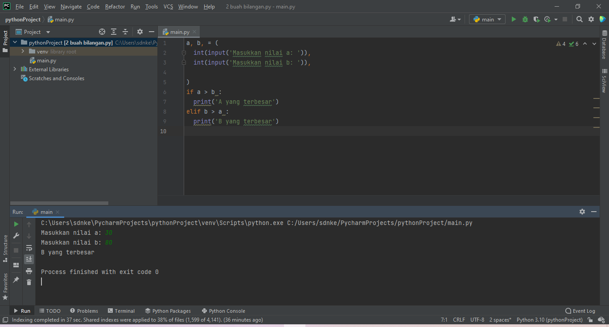
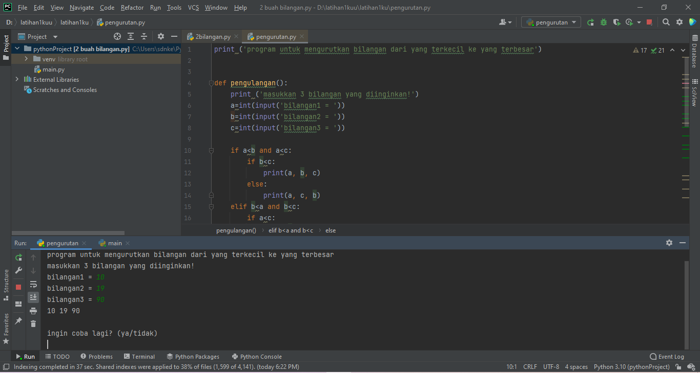
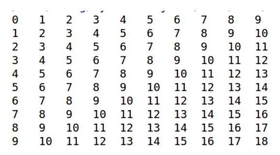
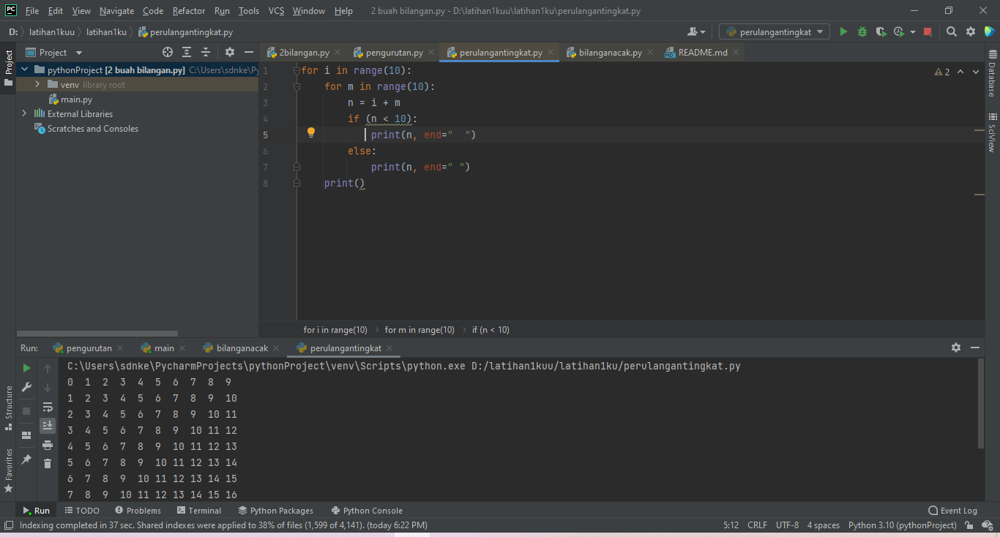
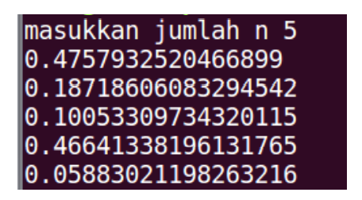
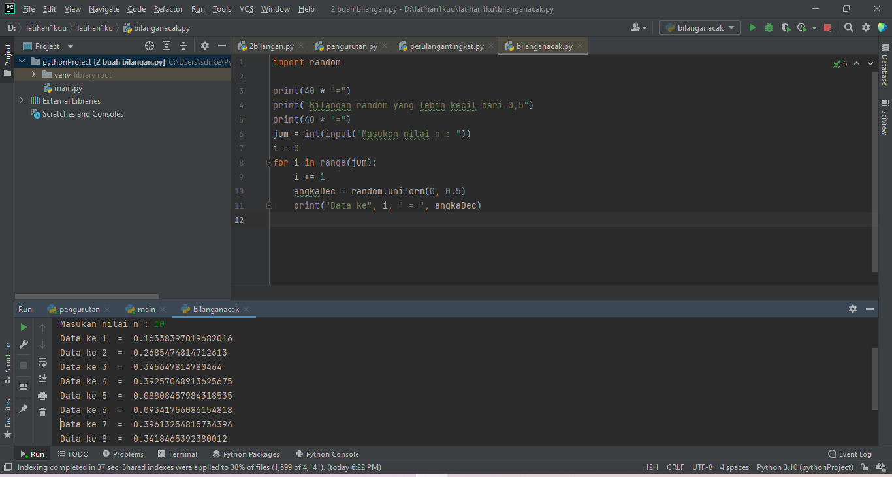

# latihan1ku
## Kondisi dan Perulangan
### Berikut programnya
1.Buat program sederhada dengan input 2 buah bilangan, kemudian
tentukan bilangan terbesar dari kedua bilangan tersebut
menggunakan statement if.

Berikut adalah hasil output nya menggunakan statement if:

    C:\Users\sdnke\PycharmProjects\pythonProject\venv\Scripts\python.exe D:/latihan1kuu/latihan1ku/2bilangan.py
    Masukkan nilai a: 10
    Masukkan nilai b: 12
    B yang terbesar
    Process finished with exit code 0
2.Buat program untuk mengurutkan data berdasarkan input sejumlah
data (minimal 3 variable input atau lebih), kemudian tampilkan
hasilnya secara berurutan mulai dari data terkecil.

Berikut untuk hasil output dari program nya:

    C:\Users\sdnke\PycharmProjects\pythonProject\venv\Scripts\python.exe D:/latihan1kuu/latihan1ku/pengurutan.py
    program untuk mengurutkan bilangan dari yang terkecil ke yang terbesar
    masukkan 3 bilangan yang diinginkan!
    bilangan1 = 10
    bilangan2 = 3
    bilangan3 = 6
    3 6 10

    ingin coba lagi? (ya/tidak)
3.Buat program dengan perulangan bertingkat (nested) for yang 
menghasilkan output sebagai berikut:

 Berikut Program nya:

Berikut untuk output dari program tersebut:
    
    C:\Users\sdnke\PycharmProjects\pythonProject\venv\Scripts\python.exe D:/latihan1kuu/latihan1ku/perulangantingkat.py
    0  1  2  3  4  5  6  7  8  9  
    1  2  3  4  5  6  7  8  9  10 
    2  3  4  5  6  7  8  9  10 11 
    3  4  5  6  7  8  9  10 11 12 
    4  5  6  7  8  9  10 11 12 13 
    5  6  7  8  9  10 11 12 13 14 
    6  7  8  9  10 11 12 13 14 15 
    7  8  9  10 11 12 13 14 15 16 
    8  9  10 11 12 13 14 15 16 17 
    9  10 11 12 13 14 15 16 17 18 

    Process finished with exit code 0
4.latihan

  • Tampilkan n bilangan acak yang lebih kecil dari 0.5.
 
  • nilai n diisi pada saat runtime

  • anda bisa menggunakan kombinasi while dan for untuk 
    menyelesaikannya

Berikut adalah program nya:

    import random

    print(40 * "=")
    print("Bilangan random yang lebih kecil dari 0,5")
    print(40 * "=")
    jum = int(input("Masukan nilai n : "))
    i = 0
    for i in range(jum):
    i += 1
    angkaDec = random.uniform(0, 0.5)
    print("Data ke", i, " = ", angkaDec)

syntax di atas untuk mencari bilangan di bawah 0,5

    import random
Sementara untuk menentukan jumlah inputan yang diinginkan maka perlu memasukan

    
    jum = int(input("Masukan nilai n : "))
Dan untuk menampilkan urutan sesua jumlah inputan dengan hasil di bawah 0,5 dengan menggunakan syntax berikut

     angkaDec = random.uniform(0, 0.5)
     print("Data ke", i, " = ", angkaDec)
Jika sudah selesai berikut hasil output dari program nya:

    C:\Users\sdnke\PycharmProjects\pythonProject\venv\Scripts\python.exe D:/latihan1kuu/latihan1ku/bilanganacak.py
    ========================================
    Bilangan random yang lebih kecil dari 0,5
    ========================================
    Masukan nilai n : 5
    Data ke 1  =  0.15939298094948484
    Data ke 2  =  0.23287293665910924
    Data ke 3  =  0.09777750216484471
    Data ke 4  =  0.25039054241480674
    Data ke 5  =  0.40529506409831234

    Process finished with exit code 0

peringatan saja untuk screenshot dan hasil output di situ untuk bilangan penulisan salah,
jadi bilangan yang seharusnya benar adalah hasil output nya mialkan kalian di output memasukan angka 5 jadi angka itu yang menjadi tugas dari materi di atas,untuk bilangan itu sesuka kalian saja,
tergantung dari kebutuhan kalian masing - masing,
dan satu lagi untuk lebih lengkap soal script program nya kalian bisa klik project nya di situ akan muncul script program nya terimakasih.

    keep smile and happy

    
    

